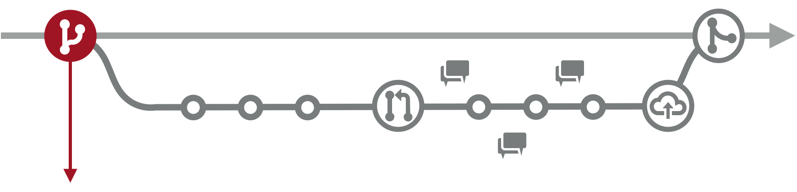
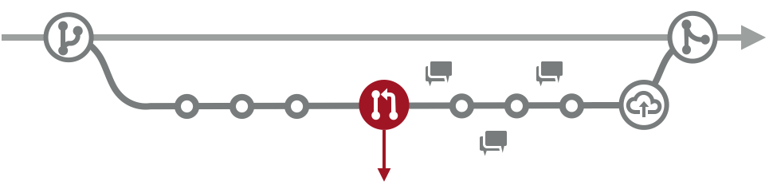
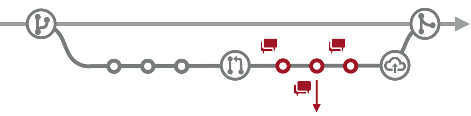
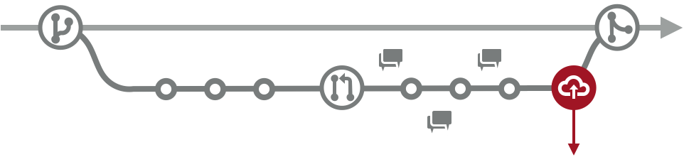

# 1. Basics

If you have never used git version control before you can continue with this guide to learn the basic commands for git:

- [Git - the simple guide](http://rogerdudler.github.io/git-guide/)

# 2. Code flow

We will never work directly on the Main or Development branch but will merge to them instead:

## 2.1 Create a branch from Main



You’ll develop your new feature or work on a bug, knowing that when finished, your feature will be ready to be tested and deployed, instead of waiting in “inventory”.

- Keep small code features.
- You must keep track of changes coming from the Development branch while your code is still in development.

## 2.2 Create code, add commits, push to Github

The commit messages should follow the next format:

```
<type>(<optional scope>): <description>
empty separator line
<optional body>
empty separator line
<optional footer>
```

The description of the commits must keep the following rules:

- Is a mandatory part of the format
- Must describe what the commit is doing
- Use the imperative, present tense: "add users endpoint", not "adds users endpoint" or "added users endpoint"
  - If you're struggling, try prepending mentally the following: "This commit will..."" or "This commit should.."

This are the types you should use for your commits:

- `feat` commits, that adds or remove a new feature
- `fix` commits, that fixes a bug
- `refactor` commits, that rewrite/restructure your code, however does not change any API behaviour
  - `perf` commits are special refactor commits, that improve performance
- `style` commits, that do not affect the meaning (white-space, formatting, missing semi-colons, etc)
- `test` commits, that add missing tests or correcting existing tests
- `docs` commits, that affect documentation only
- `build` commits, that affect build components like build tool, ci pipeline, dependencies, project version, ...
- `ops` commits, that affect operational components like infrastructure, deployment, backup, recovery, ...
- `chore` Miscellaneous commits e.g. modifying .gitignore

Breaking changes:

When creating a commit that introduces breaking changes you should add a `!` symbol before the colon and after the type of commit like this:`fix!: change documents endpoint to not overwrite previous files for users`

### Examples

```
fix(api): handle empty message in request body for users endpoint
```

```
feat!: change users/session endpoint response

refers to #456 issue

BREAKING CHANGES: new response isn't compatible with old structure so it should be changed, added task in #463 issue.
```

## 2.3 Create a pull request at Github



Lets your team know:

- Your feature is ready
- You're stuck and need help
- You're sharing code and/or general ideas
- The rest of the team might need to adapt to changes in the codebase

**A pull request must be always directed to the dev/development branch, NEVER to the main branch.**

Remember to use the Pull request template:

```markdown
### What does this PR do?

- Add "create post" button
- etc

  #### Merge Checklist:

  - [ ] The branch is up-to-date (i.e. rebased) with the base branch
  - [ ] All endpoints are working in Hoppscotch (for backend)
  - [ ] No code style issues
```

This template consists of two sections:

- A list of what the pull request does
- A list of checkboxes with information about the status of the pull request (Hoppscotch status, branch status, code style issues)

## 2.4 Discuss your code and get it reviewed at Github



- Lets you receive feedback from your teammates:
  - Questions about how to use your new code feature, or how your code will impact their current work
  - Quick tips from your teammates
- Lets you receive feedback from Tech Leads:
  - Learn how to improve your code
  - Learn development platform/framework features you might be missing
- Lets you add changes to the code upon received feedback:
  - Improve the quality of the code.
  - Add missing code features (i.e. tests, etc).

## 2.5 Deploy your feature branch to staging/demo servers



An opportunity to detect deployment issues with your code without causing trouble on live/production servers.

## 2.6 Your feature gets merged back to main at Github

By this point, your code has been reviewed, accepted, and validated on staging/demo servers, and ready to be merged back to main.

Your feature will automatically be deployed, and your work is no longer in “Code Inventory”. 

Your feature will be in “Code Inventory” and will be deployed after a sprint ends.

- Changes merged to main via “Squash & Merge”.